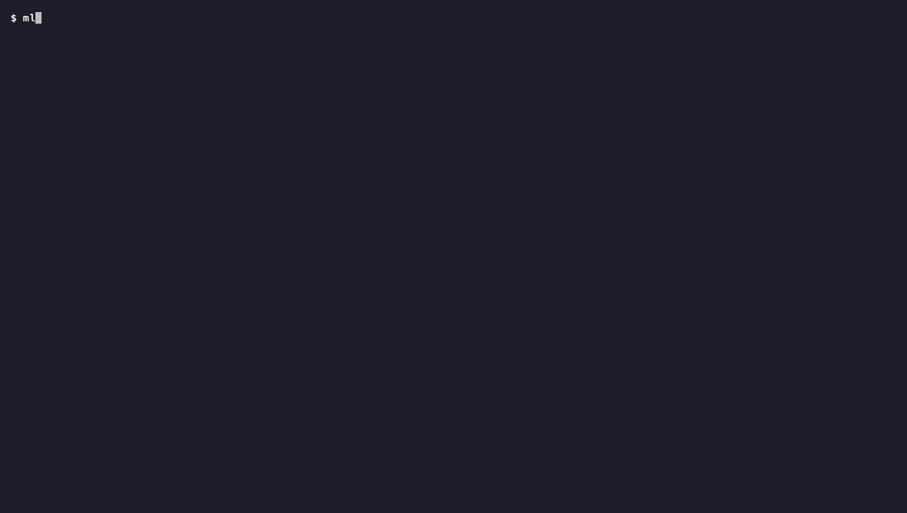

# mlglance

<p align="center">
  <a href="LICENSE"></a>
  
  
</p>

**Watch a training run from your terminal.** Loss curves, a validation-driven
verdict, and the checkpoint worth keeping — over `ssh`, inside `tmux`, with no
browser, no server, and no account. mlglance tails the metrics JSONL your trainer
already writes and turns it into a glanceable, auto-sizing dashboard.

<p align="center">
  
</p>

> **The verdict is the point.** TensorBoard and W&B show you metrics and leave the
> interpretation to you. mlglance reads the *generalization* signal and says it
> plainly: this run is **overfitting** — train kept falling after validation
> bottomed — and the checkpoint to keep is **iter 80**, not the latest step.

## Install

```bash
pip install git+https://github.com/Quill-AI-Assistant/mlglance
mlglance demo            # see it instantly — streams a synthetic run, no data needed
```

Requires Python ≥ 3.9. The only dependency is [plotext](https://github.com/piccolomo/plotext).
From a checkout, use `pip install -e .` instead.

## Why not TensorBoard or Weights & Biases?

Because you're `ssh`'d into one box watching one run, and you don't want a browser,
a server process, or a cloud account in the loop. mlglance is the gap between the
*web trackers* (semantics, but heavyweight) and the *terminal plot libraries*
(lightweight, but no training awareness):

| | browser? | server / account? | ML verdict? | names best checkpoint? | SSH / tmux native? |
|---|:---:|:---:|:---:|:---:|:---:|
| **mlglance** | **no** | **no** | **yes** — converging / overfitting / diverging | **yes** | **yes** |
| TensorBoard | yes | local server | no | no | needs port-forwarding |
| Weights & Biases | yes | cloud account | no | no | no |
| plotext / asciichartpy | no | no | no — plot only | no | yes |

## What it shows

- **A validation-driven verdict** — `converging` / `overfitting` / `diverging` /
  `plateaued`, anchored to the *generalization* signal (validation), not the noisy
  per-step train loss. When val stops improving it names the **val-optimal
  checkpoint** so you know which one to keep.
- **A high-fidelity loss curve** via [plotext](https://github.com/piccolomo/plotext) —
  braille-density train scatter + EMA trend + eval points + a best-val reference line,
  real numbered axes, log-scale (`--log-y`), sized to fill the pane. Falls back to a
  **zero-dependency ASCII** renderer when plotext isn't available or you pass
  `--ascii` / `--no-color` (and the dashboard tells you which backend drew it).
- **Honest progress + ETA** — auto-detects the total step count from the running
  trainer's `--steps` / `--max-steps`; a real bar + ETA, or an explicit over-run
  notice rather than a fake 100%.
- **Throughput & health** — tokens/sec, step-time creep, peak RAM, gradient norm —
  whatever your trainer logs. Surfaces a `HEALTHY` / `WATCH` flag.
- **Zero config** — metric-key aliases (`step`/`global_step`, `loss`/`train_loss`,
  `eval_loss`/`val_loss`, …), eval cadence, and terminal size are all auto-detected.
  The dashboard re-fits on resize, so nothing scrolls off.

## Watch your own run

Point it at the JSONL your trainer appends to:

```bash
mlglance path/to/metrics.jsonl --watch
mlglance path/to/metrics.jsonl --watch --log-y       # log-scale loss
mlglance path/to/metrics.jsonl --watch --total 5000  # if steps aren't auto-detected
```

Your trainer just needs to append one JSON object per step. Only a loss is
required; every other field is optional and its panel appears only when present:

```json
{"iter": 1, "train_loss": 4.83, "lr": 6.7e-5, "step_s": 0.21, "peak_gb": 7.4}
{"iter": 50, "train_loss": 3.91, "val_loss": 4.02, "lr": 8.6e-5}
```

### Trainer integration

Most trainers already log JSON; if not, it's a few lines. Field names are
auto-aliased, so common keys just work.

**PyTorch (manual loop):**

```python
import json
log = open("metrics.jsonl", "a")
# inside your training loop:
log.write(json.dumps({"iter": step, "train_loss": loss.item(),
                      "lr": scheduler.get_last_lr()[0]}) + "\n")
log.flush()
```

**Hugging Face `Trainer` (callback):**

```python
import json
from transformers import TrainerCallback

class JSONLLogger(TrainerCallback):
    def on_log(self, args, state, control, logs=None, **kwargs):
        if logs:                                   # logs has loss, learning_rate, eval_loss…
            with open("metrics.jsonl", "a") as f:
                f.write(json.dumps({"iter": state.global_step, **logs}) + "\n")

# trainer = Trainer(..., callbacks=[JSONLLogger()])
```

**MLX, JAX, Keras, anything else:** if it can write one line of JSON per step, mlglance can watch it.

### Flags

| flag | effect |
|---|---|
| `-w, --watch` | refresh continuously (default: render once) |
| `-n, --interval N` | refresh seconds (default 5, sub-second ok) |
| `--total N` | total steps (else auto-detected from the trainer's args) |
| `--log-y` | log-scale loss axis |
| `--ascii` | force the zero-dep ascii backend |
| `--no-color` | plain text for piping / logs (also forces the ascii backend) |
| `--title NAME` | dashboard title (else inferred from the path) |
| `--width N` / `--height N` | override the auto-detected canvas |
| `--demo` | run a live synthetic demo (no metrics file needed) |
| `--scenario {converge,overfit,diverge}` | demo scenario (default `overfit`) |
| `--version` | print version and exit |

## How the verdict works: converging, overfitting, diverging, plateaued

Validation loss is the generalization signal; per-step train loss is too noisy to
trust, so the train direction is read off its EMA. "Overfitting" is defined
**structurally** — did train keep falling *after* validation bottomed (windowed
EMA at the val-best step vs now)? — which is robust to per-step noise, unlike an
instantaneous slope. Both train and val rising together is the only genuine
*divergence* case. In every "past the best" state the dashboard points at the
val-optimal checkpoint, because that — not the latest step — is usually the one
worth keeping.

## Roadmap

- Multi-run overlay / small-multiples (compare A/B runs)
- A panel grid (LR schedule, throughput, grad-norm as their own small charts)
- Stall / NaN alerting hooks for unattended runs

## License

MIT — see [LICENSE](LICENSE).
